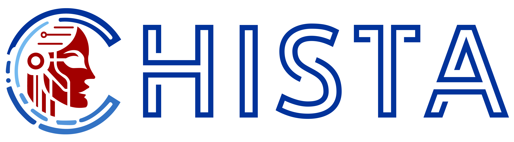

<div align="center">
  
  
  
  
  
  
  
  
  
</div>


<h1 align="center">
  <br>
  </a>
</h1>

<h1 align="center"> Chista | Open Source Threat Intelligence Framework </h1>
<p align="right"><i>v1.1</i></p>

<hr>
<p>
<p align="center">
<a href="https://x.com/ChistaDev"></a>
<a href="https://linkedin.com/company/chistadev"></a>
</p>
Chista is an Open Source Cyber Threat Intelligence (CTI) Framework designed to help users understand, predict and defend against cyber threats.


<ins>**Chista has a sweet UI!**</ins>


<ins>**Enough? no... Also has a handsome CLI!**</ins>


It helps its users understand cyber threats by using data collected from various sources. This data includes IOCs, data leaks, phishing campaigns, threat group activities and CTI sources. By analyzing this data, Chista helps users understand the existence, prevalence, trends and probability of cyber threats. 
</p>
<hr>
<p>
<ul>
  <li><b>Collecting IOCs:</b> IOCs are signatures used to identify and track cyber threats. Chista can collect IOCs from various sources and make them available to users.</li>
  <br>
  <li><b>Monitoring Data Leaks:</b> Chista can identify accounts that have suffered a data breach by monitoring data leaks from various sources.</li>
  <br>
  <li><b>Monitoring Phishing Campaigns:</b> Chista detects websites created for phishing purposes and provides users with a feed in this direction.</li> 
  <br>
  <li><b>Monitoring Threat Groups Activities:</b> Threat groups are organized groups that carry out cyber attacks. By monitoring threat group activity from various sources, Chista helps organizations understand and prepare for the activities of threat groups.</li>
  <br>
  <li><b>Detection of Blacklisted IPs:</b> Chista provides users with a feed for IPs blacklisted by various lists.</li>
  <br>
  <li><b>Detailing Threat Groups:</b> Chista brings together details of cybercrime groups, allowing users to get detailed information about threat groups.</li>
  <br>
  <li><b>Providing Resources:</b> Chista provides resources that can be used for threat intelligence for the benefit of users interested in Cyber Threat Intelligence.</li>
</ul>
</p>

Watch the video below for an introduction to Chista. In this video, you will find information about the basics of Chista and how to use it: 

[](https://www.youtube.com/watch?v=_YgUYFRND_Q)

[Chista Youtube Channel](https://www.youtube.com/@ChistaFramework)

<hr>

In this document, you'll find `usage & installation` guide. You can check our [detailed documentation](chista-docs-v1.md) about which includes **developer documentation**.

## Table of Contents  

- [Install Chista](#install-chista)
- [Basic Usage](#basic-usage)
- [Contributing](#contributing)
- [Credits](#credits)

<h2>Install Chista</h2>
<h3>Prerequisite</h3>

- go1.21
  - [https://go.dev/dl/](https://go.dev/dl/)
- Python 3.6+
  - It is needed for OpenSquat.
- OpenSquat **(Optional, increases Phishing & Impersonate module performance)**
  - https://github.com/atenreiro/opensquat
- search.censys.io API ID and API KEY **(Optional, increases Phishing & Impersonate module performance)**
  - It's used in Phishing module and controlled in .ENV file with `CENSYS_API_SECRET` key. We'll see .ENV file in the **Configuration** section.
- `7777` and `7778` ports should be available
- "**google-chrome**" executable file should present in $PATH
  - You need to install Google Chrome and it's executable should be found in your PATH (Environment Variables in Windows)

<h3>Configuration</h3>

The tool's configurations is controlled with .ENV file. The .ENV file should placed in root directory of the project. You can see an example .ENV file in below.
```sh
DUMP_MODE=true
API_ONLY=false
WHOIS_SERVER="whois.verisign-grs.com:43"
PY_PATH="C:\Users\<USERNAME>\AppData\Local\Programs\Python\Python37\python37.exe"
OPENSQUAT_PY_PATH="./3rd_party/opensquat"
CENSYS_API_ID="<API-ID>"
CENSYS_API_SECRET="<API-KEY>"
```
Configuration | Default Value | Details | Mandatory/Optional
--- | --- | --- | ---
DUMP_MODE | true | If it's `true`, the API server logs the HTTP requests. It can be useful while debugging. | Mandatory
API_ONLY | false | When it's `false`, the API server generates a WebSocket connection to the CLI tool. So, if you want to use just API part of the tool, you have to set `API_ONLY=true` | Mandatory
WHOIS_SERVER | whois.verisign-grs.com:43 | It's used in whois checker, the tool queries to the given Whois Server. | Mandatory
PY_PATH |  | It's Python's installation path. Python used for OpenSquat. If you want to use OpenSquat, you have to provide your Python path.  | Optional
OPENSQUAT_PY_PATH | ./3rd_party/opensquat | OpenSquat folder's path. The Phishing module uses OpenSquat to generate extra typosquatting domains. | Optional
CENSYS_API_ID |  | search.censys.io API Key ID | Optional
CENSYS_API_SECRET |  | search.censys.io API Key Secret | Optional

<h2>Basic Usage</h2>

You can use pre-built binaries or you can build the project and use. It's up to your choice!

<h3>Building & Running from source</h3>

**1. Clone the repository**
```sh
git clone https://github.com/Chista-Framework/Chista.git
```
**2. Build & Run the API application**

First, open a Command Prompt/Terminal. Then execute the following commands.
- For Windows:
```sh
go build -o chista.exe
./chista.exe
```
- For Linux: 
```sh
go build -o chista
./chista
```
NOTE: If you cannot execute the command in Linux, you should give execute permission yourself on the file. You can use `chmod +x chista`.
After running the API server, you'll see the following output.
```sh
time="2024-01-12T16:12:08+03:00" level=info msg="DUMP_MODE= true" func=github.com/Chista-Framework/Chista/logger.init.0 file="C:/Users/ResulBozburun/Desktop/Personal/Go/chista/logger/logger.go:54"
time="2024-01-12T16:12:08+03:00" level=error msg="WebSocket connection error while closing: Websocket Connection is nil but trying to send a WS message." func=github.com/Chista-Framework/Chista/helpers.SendMessageWS file="C:/Users/ResulBozburun/Desktop/Personal/Go/chista/helpers/helpers.go:230"
[GIN-debug] [WARNING] Creating an Engine instance with the Logger and Recovery middleware already attached.

[GIN-debug] [WARNING] Running in "debug" mode. Switch to "release" mode in production.
 - using env:   export GIN_MODE=release
 - using code:  gin.SetMode(gin.ReleaseMode)

[GIN-debug] GET    /api/v1/ioc_feed          --> github.com/Chista-Framework/Chista/controller.GetIocs (6 handlers)
[GIN-debug] GET    /api/v1/phishing          --> github.com/Chista-Framework/Chista/controller.GetPhishingDomains (6 handlers)
[GIN-debug] GET    /api/v1/impersonate       --> github.com/Chista-Framework/Chista/controller.GetImpersonatingDomains (6 handlers)
[GIN-debug] GET    /api/v1/leak              --> github.com/Chista-Framework/Chista/controller.GetLeaks (6 handlers)
[GIN-debug] GET    /api/v1/threat_profile    --> github.com/Chista-Framework/Chista/controller.GetThreatActorProfiles (6 handlers)
[GIN-debug] GET    /api/v1/blacklist         --> github.com/Chista-Framework/Chista/controller.CheckBlacklist (6 handlers)
[GIN-debug] GET    /api/v1/source            --> github.com/Chista-Framework/Chista/controller.GetSources (6 handlers)
[GIN-debug] GET    /api/v1/c2                --> github.com/Chista-Framework/Chista/controller.GetC2s (6 handlers)
[GIN-debug] GET    /api/v1/activities        --> github.com/Chista-Framework/Chista/controller.CheckActivities (6 handlers)
[GIN-debug] [WARNING] You trusted all proxies, this is NOT safe. We recommend you to set a value.
Please check https://pkg.go.dev/github.com/gin-gonic/gin#readme-don-t-trust-all-proxies for details.
[GIN-debug] Listening and serving HTTP on localhost:7777
time="2024-01-12T16:12:08+03:00" level=debug msg="Starting the Apt Profiles Data Check periodic function\n" func=github.com/Chista-Framework/Chista/helpers.RunPeriodicly.func1 file="C:/Users/ResulBozburun/Desktop/Personal/Go/chista/helpers/helpers.go:595"
time="2024-01-12T16:12:08+03:00" level=debug msg="Starting the Ransomware Profiles Data Check periodic function\n" func=github.com/Chista-Framework/Chista/helpers.RunPeriodicly.func1 file="C:/Users/ResulBozburun/Desktop/Personal/Go/chista/helpers/helpers.go:595"
time="2024-01-12T16:12:08+03:00" level=debug msg="Requesting source for ransom data." func=github.com/Chista-Framework/Chista/controller.GetRansomProfileData file="C:/Users/ResulBozburun/Desktop/Personal/Go/chista/controller/threat_profile.go:176"
time="2024-01-12T16:12:08+03:00" level=debug msg="Starting the Ransom Data Check periodic function\n" func=github.com/Chista-Framework/Chista/helpers.RunPeriodicly.func1 file="C:/Users/ResulBozburun/Desktop/Personal/Go/chista/helpers/helpers.go:595"
time="2024-01-12T16:12:08+03:00" level=debug msg="Requesting source for ransom data." func=github.com/Chista-Framework/Chista/controller.GetRansomwatchData file="C:/Users/ResulBozburun/Desktop/Personal/Go/chista/controller/activities.go:132"
time="2024-01-12T16:12:09+03:00" level=debug msg="Ransom data has been updated." func=github.com/Chista-Framework/Chista/controller.GetRansomProfileData file="C:/Users/ResulBozburun/Desktop/Personal/Go/chista/controller/threat_profile.go:212"
time="2024-01-12T16:12:09+03:00" level=info msg="Ransom data is up to date. No need to write to the file." func=github.com/Chista-Framework/Chista/controller.GetRansomwatchData file="C:/Users/ResulBozburun/Desktop/Personal/Go/chista/controller/activities.go:158"
time="2024-01-12T16:12:10+03:00" level=info msg="Apt profiles data is up to date. No need to write to the file." func=github.com/Chista-Framework/Chista/controller.getAPTData file="C:/Users/ResulBozburun/Desktop/Personal/Go/chista/controller/threat_profile.go:364"
```
  
**3. Build & Run the CLI application**
- For Windows:
```sh
cd chista-cli
go build -o chista-cli.exe
```
- For Linux:
```sh
cd chista-cli
go build -o chista-cli
```
After running the CLI application, you'll see the following output.
```sh
     _     _      _
 __ | |_  (_) ___| |_  __ _
/ _|| ' \ | |(_-<|  _|/ _` |
\__||_||_||_|/__/ \__|\__,_|
-----------------------------
Chista is a command-line tool that helps you perform various cyber threat intelligence tasks. You can use Chista to search for information about malicious activities, indicators of compromise, data leaks, phishing campaigns, and threat sources.
Chista also provides you with a blacklist of malicious domains and IP addresses that you can use to protect your network. With Chista, you can easily access and analyze data from various sources, such as VirusTotal, Shodan, Have I Been Pwned, and more.

To get started, simply run Chista with one of the subcommands: activities, blacklist, ioc, leak, phishing, or source. You can also use the -h or --help flag to get more information about each subcommand and its options.

Usage:
  Chista [command]

Available Commands:
  activities    Lists latest activities
  blacklist     Shows the blacklist sources.
  completion    Generate the autocompletion script for the specified shell
  help          Help about any command
  impersonate   Lists impersonating domains
  ioc           Lists IOC data
  leak          Lists leak infos
  phishing      Lists phishing domains
  source        Lists data related to parameters.
  threatProfile Lists latest threat profile

Flags:
  -h, --help     help for Chista
  -t, --toggle   Help message for toggle

Use "Chista [command] --help" for more information about a command.

```

<h3>Directly running the binaries</h3>

You can download the API Server & CLI binaries according to your OS from [releases](https://github.com/Chista-Framework/Chista/releases) then just execute.
- For Windows:
```sh
./chista.exe
./chista-cli.exe
```
- For Linux:
```sh
./chista
./chista-cli
```


<h2>API Usage</h2>

Chista provides data feed to users via API. In order to use Chista on the API, the following command is executed in the main directory and the Web Socket is started on localhost.

```sh
go run main.go
```
The following message indicates that the Chista API is up and running
```sh
[GIN-debug] Listening and serving HTTP on localhost:7777
```
After this stage, data feed can be provided via API by sending a request to the relevant endpoint

Endpoint | Method | Query Params | Description
--- | --- | --- | ---
/api/v1/ioc_feed | GET | attacker, verbosity | List all of the IOC data related with used query params.
/api/v1/leak | GET | email, verbosity | List all of the leak info related with used query params
/api/v1/phishing | GET | domain, verbosity | List all of the latest phishing domains that related with the supplied query param.
/api/v1/impersonate | GET | domain, verbosity | List all of the impersonating domains that related with the supplied query param.
/api/v1/activities | GET | ransom, list, verbosity | List all of the latest activites of attacker related with the supplied query param.
/api/v1/source | GET | ransom, apt, forum, market, telegram, exploit, discord, verbosity | List all of the data related with the supplied query param.
/api/v1/blacklist | GET | asset, verbosity | Shows the blacklist sources that the supplied asset marked as “malicious”.
/api/v1/threat_profile | GET | apt, ransom, list, verbosity | Brings together details of cybercrime groups, allowing users to get detailed information about threat groups

Read the [Documentation](https://github.com/Chista-Framework/Chista/blob/main/chista-docs-v1.md) for more details

<h2>CLI Usage</h2>

Chista can be run on the CLI according to user needs. In order to use Chista on the CLI, Web Socket must first be launched in the main directory.

```sh
./main.exe
```
The following message indicates that the Chista API is up and running
```sh
[GIN-debug] Listening and serving HTTP on localhost:7777
```
Then type the command to run the desired module in the <b>chista-cli</b> directory
```sh
./main.exe <module_name> <parameter> <value>
```

Sample IOC Module output
```sh
[+] IOC module started...
[+] Attacker: redline
[+] API Requester registered.
[+] Client connected

---------------------
[INFO] [ioc] Getting data for redline...
------------------- [IOC Datas] -------------------
[INFO] [ioc] Sha256hash: 7305e9a0ff144653b5a14bdc6cdde7cd0728d8c3a94a3f90dca9c707bf3693b1
[INFO] [ioc] Sha3384: 3f6130cec141fc1fa44aa07a975db231684caaa1d50d9abdda3661203f083863e6049e4ab7fefea27be95939e63d618e
[INFO] [ioc] Sha1Hash: 844346b4963f7ef5e856ddf78e5bc19da589d283
[INFO] [ioc] Md5Hash: 7267376bbda1404d51e00acab6660499
[INFO] [ioc] FirstSeen: 2023-04-04 13:53:22
[INFO] [ioc] LastSeen:
[INFO] [ioc] FileName: 7267376bbda1404d51e00acab6660499.bin
[INFO] [ioc] FileType: exe
[INFO] [ioc] Signature: Redline
[INFO] [ioc] Tags: [bin exe Redline]
```

<h3>Usage Examples</h3>

- **Phishing Module**: Get the list of possible which domains. Exclude `paypalc3.com` and `paypal-community.com`, I know these are not phishing domains.
```sh
./main.exe phishing -d paypal.com -e paypalc3.com,paypal-community.com -v
```
- **Leak Module**: Checks leak sources and gathers data if the supplied email leaked.
```sh
./main.exe leak --email info@chista.tld 
```

<h2>Contributing</h2>

You can create Pull Requests to contribute this project. Please check our [Contributing to Chista CTI Framework](CONTRIBUTING.md) document for more information about contributing.


<h2>Credits</h2>

We would like to thank all the individuals, developers, communities and the entire open source world for supporting the project :heart:
- Phishing & Impersonate Module is powered by [OpenSquat](https://github.com/atenreiro/opensquat), [Censys](https://censys.com/), [crt.sh](https://crt.sh/), [DNSTwist](https://dnstwist.it/)
- Data Leak Module is powered by [Mozilla Monitor](https://monitor.mozilla.org/),
- IOC Module is powered by [MalwareBazaar](https://bazaar.abuse.ch/)
- Blacklist Module is powered by [MxToolBox](https://mxtoolbox.com/)
- Ransomware Activities Module is powered by [RansomWatch](https://raw.githubusercontent.com/joshhighet/ransomwatch/)
- CTI Source Module is powered by [DeepDarkCTI](https://github.com/fastfire/deepdarkCTI/)
- Threat Profile Module is powered by [Electronic Transactions Development Agency](https://apt.etda.or.th/cgi-bin/aptgroups.cgi), [RansomWatch](https://raw.githubusercontent.com/joshhighet/ransomwatch/)

<h3>:heart: Project Leaders </h3>

[Yusuf Yıldız](https://www.linkedin.com/in/yusufyildiz11/) :muscle:
[Furkan Öztürk](https://www.linkedin.com/in/furkannozturk/) :muscle:
[Resul Bozburun](https://www.linkedin.com/in/rbozburun/) 

<h3>:heart: Front-End Developer </h3>

[Furkan Fırat](https://www.linkedin.com/in/furkan-f%C4%B1rat-058195161/) 

<h3>:heart: Project Graphic Designer</h3>

[Yakuphan Devrez](https://www.linkedin.com/in/yakuphandevrez/)
